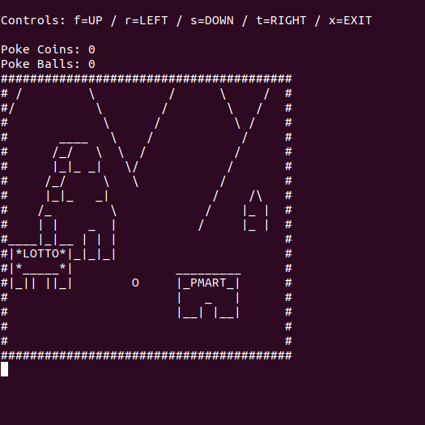
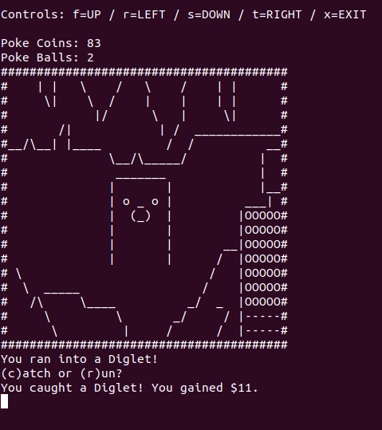
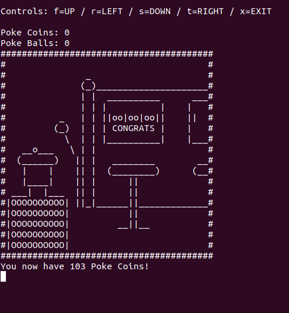
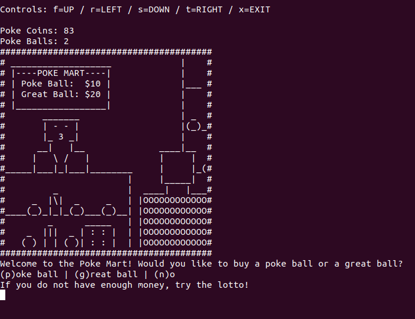

# assembly-mon
Short pokemon game written in assembly. There's only one pokemon to catch!

You, as the player, begin on a movable board with a few different exploratory options.
(Movement keys are FRST so I could test it more easily on a colemak layout)

If you choose to go to the upper right in the mountain, you may find a pokemon!

But you need money and poke balls first! Go to the lotto in the lower left. You may gain money, or lose it all!

Once you have money, you can buy some poke balls at the poke mart and catch as many diglet as you could possibly want (although who really wants diglets?)

